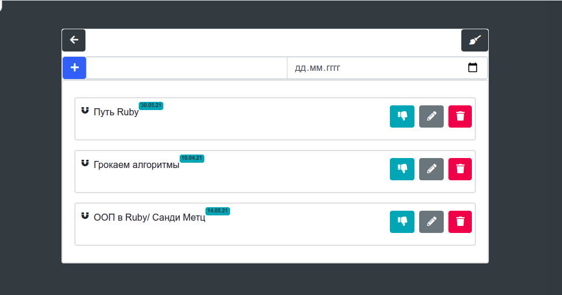

# Reflex TODO

Приложение todo для понимания как работает StimulusReflex, его сильные и слабые стороны. Реализовано в учебных целях.

### Что сделано
1. Реализована основная логика Тудушки:
  + можно создавать листы,
  + добавлять в них задачки,
  + отмечать выполнение,
  + удалять листы,
  + удалять задачи
  + есть простенькие дедлайны
2. Все сделано с возможностями `StumulusReflex`

### Что еще необходимо сделать:
1. Переписать на компонентную структуру с использованием `view_component`
2. Добавить аутентификацию и авторизацию
3. Отрихтовать внешний вид (по желанию)
